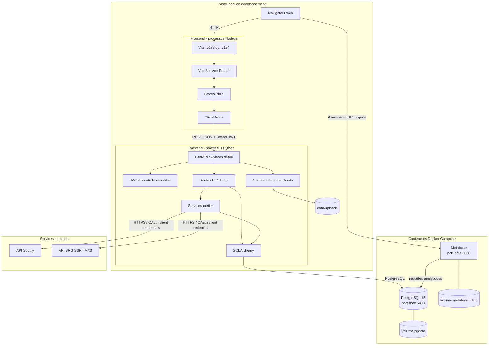
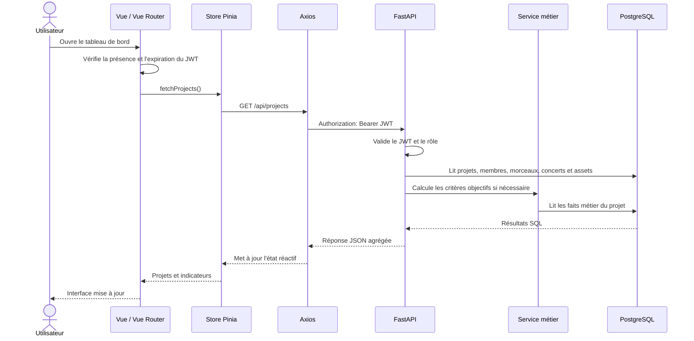

# Architecture de Vue Carter

## 1. Vue d'ensemble

Vue Carter est une application web de gestion et d'accompagnement de projets musicaux. Son architecture actuelle suit un modèle client-serveur en trois couches :

1. une application monopage Vue.js pour l'interface utilisateur ;
2. une API REST FastAPI pour l'authentification, les règles métier et l'accès aux données ;
3. une base PostgreSQL pour la persistance relationnelle.

Deux composants complètent ce socle : Metabase pour les tableaux de bord analytiques et un stockage local pour les médias. L'API communique également avec Spotify et MX3 afin d'importer ou de synchroniser certaines données publiques.

## 2. Diagramme de déploiement actuel

Dans l'environnement actuel, seuls PostgreSQL et Metabase sont déclarés dans `docker-compose.yml`. Le frontend Vite et l'API Uvicorn sont lancés directement sur la machine hôte. Il ne s'agit donc pas encore d'un déploiement entièrement conteneurisé.

## 3. Diagramme de flux d'une consultation de projet

Le frontend ne se connecte jamais directement à PostgreSQL. Toute lecture ou modification passe par l'API, qui applique les contrôles d'accès et les règles métier.

## 4. Couche de présentation

Le frontend est une SPA développée avec Vue 3, TypeScript, Vite et Tailwind CSS.

- `main.ts` initialise Vue, Pinia et Vue Router.
- Vue Router associe les URL aux vues artiste, expert, accompagnant et administration.
- Les gardes de navigation contrôlent localement la présence, l'expiration et le rôle du JWT.
- Les stores Pinia centralisent l'état partagé et les appels à l'API : projets, campagnes d'évaluation, critères, échéances et administration.
- Le client Axios utilise `/api` comme point d'entrée, ajoute automatiquement le JWT et redirige vers la connexion après une réponse `401`.
- Les composants Vue rendent les données réactives et déclenchent les actions de lecture ou de modification.

Les principaux parcours sont :

| Espace | Responsabilité |
|---|---|
| Artiste | Profil, projets, membres, morceaux, concerts, médias et connecteurs |
| Expert / gestionnaire | Consultation des projets, évaluations, rapports et analytics |
| Accompagnant | Consultation des projets affectés et suivi d'accompagnement |
| Administration | Utilisateurs, référentiels et accès transversal aux vues |

La vérification du rôle dans le routeur améliore l'expérience utilisateur, mais elle ne constitue pas la sécurité principale. Chaque opération sensible doit également être autorisée côté FastAPI.

## 5. Couche API et métier

FastAPI expose des routes REST sous le préfixe `/api`. L'application principale assemble plusieurs routeurs spécialisés : authentification, administration, analytics, ETL, campagnes d'évaluation, critères, subventions, référentiels, styles et utilisateurs.

Les responsabilités du backend sont les suivantes :

- valider les requêtes et réponses avec Pydantic ;
- authentifier les utilisateurs par JWT signé en `HS256` ;
- appliquer les droits selon les rôles et les rattachements aux projets ;
- exécuter les règles métier, par exemple les critères objectifs d'évaluation ;
- orchestrer les transactions PostgreSQL avec SQLAlchemy ;
- appeler les services Spotify et MX3 sans exposer leurs secrets au navigateur ;
- enregistrer et servir les assets téléversés sous `/uploads` ;
- produire une URL Metabase signée et temporaire pour les utilisateurs autorisés.

Une partie importante des requêtes utilise SQLAlchemy avec du SQL explicite. Ce choix rend les requêtes métier visibles et contrôlables, mais augmente le couplage entre le schéma relationnel et le code de l'API.

## 6. Persistance et données

PostgreSQL constitue la source de vérité. Les principales familles de données sont :

- identités, comptes, rôles et invitations ;
- projets musicaux, membres et styles ;
- morceaux, concerts, lieux, formations et accompagnements ;
- assets et événements de parcours ;
- présences web et relevés de métriques ;
- campagnes, critères, bilans et appréciations d'évaluation ;
- échéances et déclarations de demandes de subvention.

SQLAlchemy fournit le moteur de connexion et un pool de sessions. FastAPI injecte une session par requête et la ferme à la fin du traitement. Les migrations SQL versionnées à la racine décrivent l'évolution du schéma, tandis que le script V12 permet de créer une base consolidée.

Les fichiers binaires ne sont pas stockés dans PostgreSQL. La base conserve leurs métadonnées et leur chemin, tandis que le contenu est enregistré dans `data/uploads`. En production, ce dossier devrait être remplacé ou monté sur un stockage persistant sauvegardé.

## 7. Authentification et autorisation

Le flux d'authentification est le suivant :

1. l'utilisateur envoie son adresse e-mail et son mot de passe à `/api/auth/login` ;
2. FastAPI vérifie le hash du mot de passe et l'état du compte ;
3. l'API émet un JWT contenant l'identifiant du compte, le rôle et l'identifiant de la personne ;
4. le frontend conserve le jeton dans `localStorage` ;
5. Axios ajoute `Authorization: Bearer <token>` à chaque appel ;
6. FastAPI revalide le jeton et les autorisations pour chaque route protégée.

Les rôles applicatifs sont `artiste`, `gestionnaire_case`, `expert_jury`, `accompagnant` et `admin`. Certaines autorisations dépendent aussi d'une relation métier : appartenance à un projet, affectation d'accompagnement ou participation à un jury.

## 8. Connecteurs et flux ETL

Les connecteurs Spotify et MX3 sont pilotés par des endpoints FastAPI. Le navigateur demande une opération, le backend appelle l'API externe avec des secrets conservés dans `.env`, transforme les données, puis persiste uniquement les éléments autorisés dans PostgreSQL.

Deux types de flux coexistent :

- consultation à la volée, par exemple le catalogue Spotify proposé avant import ;
- synchronisation persistante, par exemple les morceaux sélectionnés, concerts MX3 ou relevés de métriques.

Cette implémentation est actuellement synchrone et déclenchée par une requête HTTP. Malgré leur mention dans le README et les dépendances, Prefect, Parquet et un pipeline DuckDB ne sont pas encore intégrés au code applicatif. Ils doivent être présentés comme une évolution possible pour planifier, historiser et rejouer des traitements volumineux.

## 9. Analytics avec Metabase

Metabase interroge PostgreSQL, principalement au travers de vues analytiques. Le frontend ne reçoit jamais la clé d'intégration Metabase : il demande à FastAPI une URL d'intégration signée, valable dix minutes.

Pour un accompagnant, l'API limite le tableau de bord aux projets qui lui sont affectés. Le navigateur charge ensuite Metabase dans une iframe. Cette séparation permet de déléguer la visualisation décisionnelle sans donner au frontend un accès SQL direct.

## 10. Lecture architecturale

### Points forts

- séparation nette entre interface, API et persistance ;
- source de vérité unique dans PostgreSQL ;
- secrets des connecteurs conservés côté serveur ;
- validation Pydantic et contrôles d'accès côté backend ;
- état frontend centralisé avec Pinia ;
- analytics isolés dans Metabase ;
- stockage des médias séparé des données relationnelles.

### Limites actuelles

- le frontend et FastAPI ne sont pas encore conteneurisés par Docker Compose ;
- une grande partie des routes projet reste concentrée dans `backend_etl/main.py` ;
- les traitements ETL sont synchrones et non orchestrés ;
- le JWT est conservé dans `localStorage`, ce qui impose une protection rigoureuse contre les failles XSS ;
- les assets utilisent le système de fichiers local, qui doit être sauvegardé et partagé en cas de déploiement multi-instance ;
- la configuration CORS doit inclure explicitement l'origine frontend réellement utilisée ;
- les ports Docker actuels sont publiés sur l'hôte sans restriction d'interface dans le fichier Compose.

## 11. Évolution de déploiement recommandée

Pour passer d'un environnement de développement à une architecture de production, les évolutions prioritaires sont :

1. construire une image frontend et une image backend reproductibles ;
2. placer un reverse proxy HTTPS devant le frontend, l'API et les médias ;
3. ne pas exposer PostgreSQL directement au réseau public ;
4. externaliser les secrets dans l'environnement de déploiement ;
5. utiliser un stockage persistant sauvegardé pour les assets ;
6. ajouter un orchestrateur de tâches uniquement si les synchronisations deviennent longues ou planifiées ;
7. mettre en place les journaux, métriques, sauvegardes et contrôles de disponibilité.

L'architecture logique resterait la même : le navigateur dialogue avec l'API, l'API porte la sécurité et les règles métier, et PostgreSQL demeure la source de vérité.

## 12. Fichiers de référence

- `frontend/src/main.ts` : initialisation de l'application Vue ;
- `frontend/src/router/index.ts` : routes et gardes d'accès ;
- `frontend/src/services/api.ts` : client HTTP et gestion du JWT ;
- `frontend/src/stores/` : état applicatif et appels API ;
- `backend_etl/main.py` : application FastAPI et routes projet historiques ;
- `backend_etl/routers/` : routes spécialisées ;
- `backend_etl/services/` : logique métier et connecteurs ;
- `backend_etl/core/config.py` : configuration et secrets ;
- `database/database.py` : moteur SQLAlchemy et sessions ;
- `docker-compose.yml` : PostgreSQL et Metabase ;
- `data/uploads/` : stockage local des médias.
